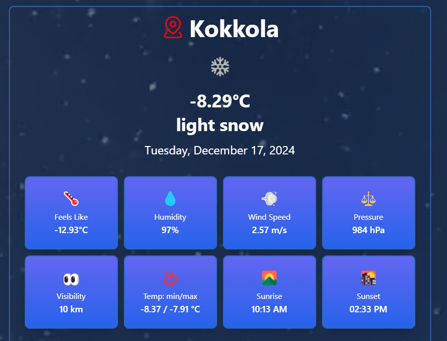

# Weather App

This is a weather application built using React, Vite, and Tailwind CSS. The app allows users to search for a municipality/area and fetches the weather data of the given location. It displays current weather details, a 5-day weather forecast and graph (with 3-hour intervals), a weather map, and a weather widget. Additionally, the app uses Gemini AI to provide a description of the searched area.

## Features

- **Search for Weather**: Users can search for any municipality/area or use their current location to fetch the weather data.
- **Current Weather**: Displays the current temperature, weather conditions, wind speed, and more.
- **5-Day Forecast**: Fetches weather data for the next 5 days in 3-hour intervals.
- **Weather Map**: Displays a weather map for better visualization of the forecast.
- **Area Description**: Generates a description of the searched area using Gemini AI, providing details about the location's characteristics and features.

## Technologies Used

- **React**: Frontend framework to build the user interface.
- **Vite**: A build tool for fast development and production builds.
- **Tailwind CSS**: A utility-first CSS framework for styling.
- **OpenWeatherAPI**: Used to fetch current weather data, forecasts, and weather maps.
- **Gemini AI**: Used to generate a description of the searched area.

## Getting Started
### Prerequisites
Before running the project, ensure you have the following installed:

- **Node.js** 
- **npm** (Node Package Manager)
- **Git**

You will also need API keys for:

- OpenWeatherAPI
- Gemini AI (Google API Key)

## Getting API Keys

### 1. OpenWeatherAPI

1. Visit [OpenWeatherMap](https://home.openweathermap.org/).
2. Sign up or log in to your account.
3. Navigate to the **API Keys** section.
4. Copy or Generate a new API key.
5. Copy the key for later use.

### 2. Gemini AI (Google API Key)

1. Visit the [Google AI Studio](https://aistudio.google.com/app/apikey).
2. Sign up or log in with your Google account.
3. Generate an API key from the **API Console** by clicking Create API Key button.
4. Choose project name as Gemini API.
4. Copy the key for later use.

## Installation

Follow these steps to set up and run the Weather App:

1. **Clone the repository**:  
   Open your terminal and run the following command to clone the repository:

   ```bash
   git clone https://github.com/zprakash/Weather-App.git
   ```

2. **Navigate to the project directory**:  
   Move into the project folder:

   ```bash
   cd Weather-App
   ```

3. **Install dependencies**:  
   Install all the required packages using npm:

   ```bash
   npm install
   ```

4. **Set up API KEYS**:  
   Go to a `.env` file in the root directory of the project and add your API keys:

   ```env
   VITE_WEATHER_API_KEY="your-openweather-api-key"
   VITE_GEMINI_API_KEY="your-gemini-api-key"
   ```

   Replace `your-openweather-api-key` and `your-gemini-api-key` with your actual API keys.

5. **Run the development server**:  
   Start the application locally with the following command:

   ```bash
   npm run dev
   ```

6. **Access the app**:  
   Open your browser and go to:

   ```
   http://localhost:5173
   ```

   The app will now be running locally.

## Usage

- Upon loading the app, you can either search for a municipality/area or use your current location.
- After searching, the app will show the current weather, the forecast for the next 5 days with graph, weather map and a weather widget.
- The description of the searched area will also be shown.

## Screenshots

### Home Page


### Search


### Current Weather


### Description


### Forecast Details


### Forecast Graph


### Widget


### Auto location detection


### Current Weatehr Stats


## Contributing

If you'd like to contribute to this project, feel free to fork the repository and submit a pull request. Make sure to follow the coding style and test any changes you make.

## License

This project is open-source and available under the MIT License. See the LICENSE file for more information.
